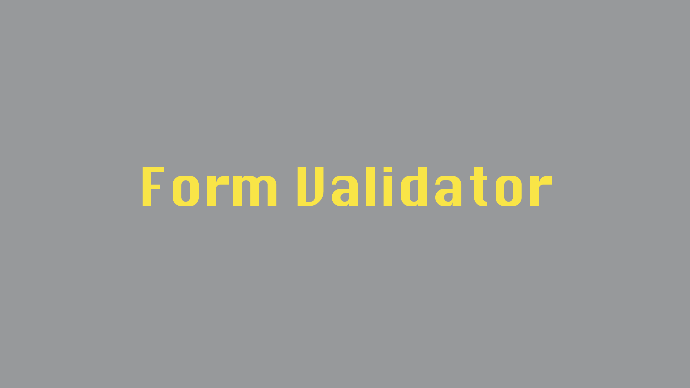

# Form Validator

## Table of contents

- [General info](#general-info)
- [Screenshots](#screenshots)
- [Technologies](#technologies)
- [Setup](#setup)
- [Features](#features)
- [Status](#status)
- [Inspiration](#inspiration)
- [Contact](#contact)

---

## General info

Form Validator simple form validation application.

[Back to top](#form-validator)

---

## Screenshots

[Back to top](#form-validator)

---

## Technologies

- [Git](https://git-scm.com) - Version Control
- [HTML](https://developer.mozilla.org/en-US/docs/Web/HTML) - Markup
- [CSS](https://developer.mozilla.org/en-US/docs/Web/CSS) - Styling
- [Javascript](https://developer.mozilla.org/en-US/docs/Web/JavaScript) - Scripting
- [Next](https://nextjs.org/) - Frontend React Framework
- [Jest](https://jestjs.io/) - Testing
- [Eslint](https://eslint.org/) - Linting
- [Prettier](https://prettier.io/) - Code Style
- [JsDoc](https://jsdoc.app/) - Documentation

[Back to top](#form-validator)

---

## Setup

- Ensure you have node, npm and git installed on your system
- Clone the repo using `git clone https://github.com/bryansmullen/form-validator.git`
- Install project dependancies with `npm install`
- Run `npm start`

[Back to top](#form-validator)

---

## Features

[Back to top](#form-validator)

---

## Status

Project is: _under construction_

[Back to top](#form-validator)

---

## Inspiration

Based on [Brad Traversy's](https://github.com/bradtraversy/it-logger) 20 Web Projects With Vanilla JavaScript course on [Udemy](https://www.udemy.com/course/web-projects-with-vanilla-javascript/).

[Back to top](#form-validator)

---

## Contact

Created by [@bryansmullen](https://github.com/bryansmullen) - feel free to contact me!

[Back to top](#form-validator)
